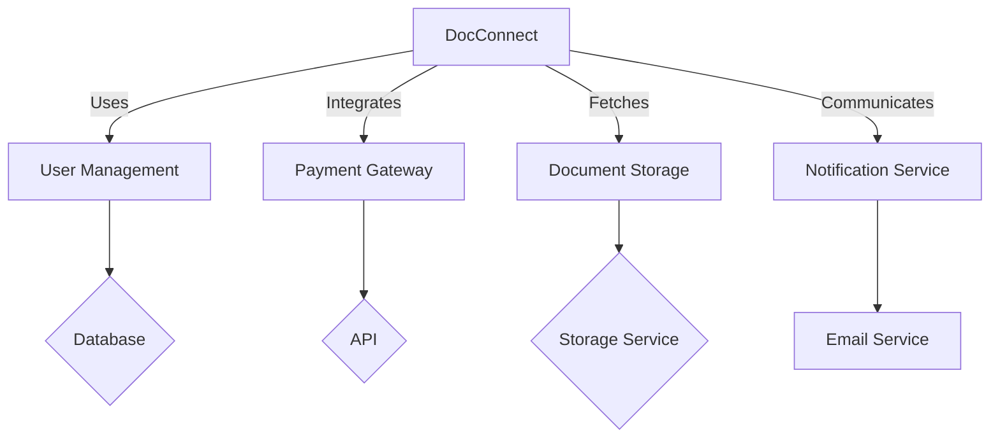

```mermaid
%%{ init : {'theme' : 'default'}}%%
  graph TD;
      A[DocConnect] -->|Uses| B[User Management]
      A -->|Integrates| C[Payment Gateway]
      A -->|Fetches| D[Document Storage]
      A -->|Communicates| E[Notification Service]
      B --> F{Database}
      C --> G{API}
      D --> H{Storage Service}
      E --> I[Email Service]
```